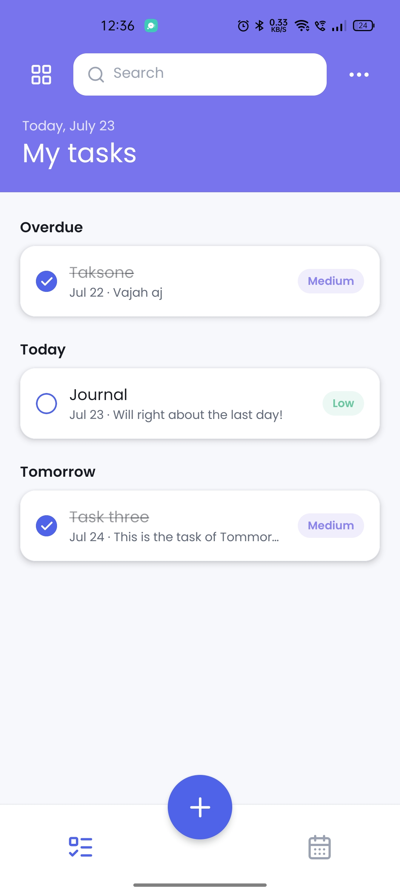
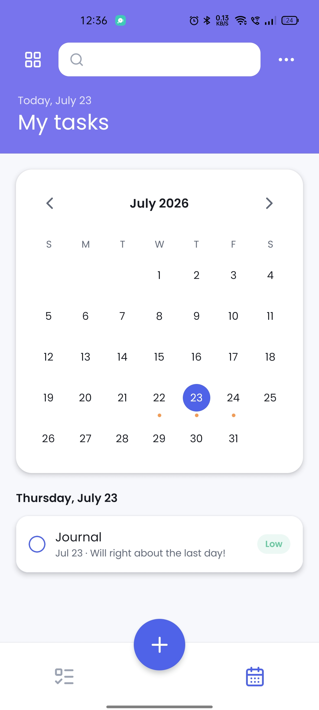
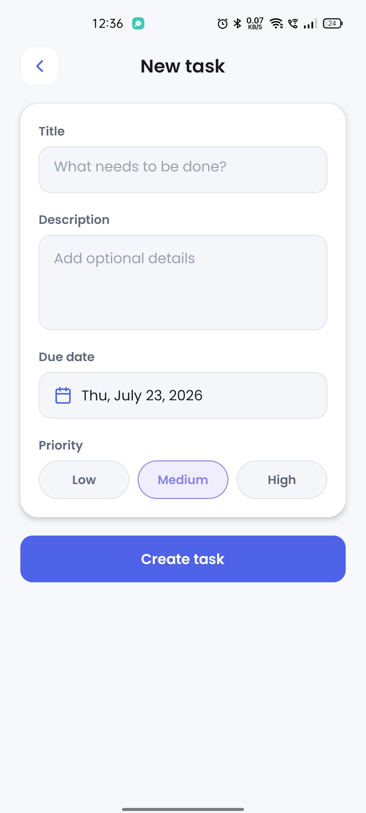

# Task Management

<p align="center">
  
</p>

<p align="center">
  A responsive task-management app for Android, iOS, and web, built with Expo, React Native,
  Firebase, TanStack Query, and Zustand.
</p>

## App Preview

<p align="center">
  
  &nbsp;
  
  &nbsp;
  
</p>

<p align="center">
  <sub>Task List &nbsp;&nbsp;&nbsp; Calendar &nbsp;&nbsp;&nbsp; Create Task</sub>
</p>

## Features

- Email/password registration, login, session restoration, and sign-out with Firebase Authentication
- Per-user task creation, viewing, editing, completion, and deletion
- Real-time task synchronization with Cloud Firestore
- Title and description search with animated placeholder text
- Combined priority and completion-status filters
- Tasks sorted by due date and grouped into Overdue, Today, Tomorrow, This week, and Later
- List and swipeable calendar views with animated month navigation
- Swipe right to complete and swipe left to delete, with confirmation before deletion
- Animated task completion with reduced-motion support
- Read-only details for completed tasks, enforced by both the UI and Firestore rules
- Persistent light and dark themes
- Responsive layouts, safe-area handling, keyboard-aware forms, and accessible touch targets

## Technology

| Area                   | Technology                                       |
| ---------------------- | ------------------------------------------------ |
| Application            | Expo 54, React Native 0.81, React 19, TypeScript |
| Navigation             | Expo Router                                      |
| Authentication         | Firebase Authentication                          |
| Database               | Cloud Firestore                                  |
| Server state           | TanStack Query                                   |
| Local UI state         | Zustand                                          |
| Persistence            | AsyncStorage                                     |
| Gestures and animation | React Native Gesture Handler and Animated        |
| Styling                | Reusable theme tokens and Poppins typography     |

Firebase Storage is not currently used because tasks do not include file or image attachments.
The social-provider buttons in the interface are visual only; authentication currently supports
email and password.

## Application flow

```text
App start
  ├─ Restore theme, onboarding state, fonts, and Firebase session
  ├─ First unauthenticated visit → Onboarding → Login or Sign up
  ├─ Returning unauthenticated visit → Login
  └─ Authenticated session → My Tasks
                               ├─ List view
                               ├─ Calendar view
                               ├─ Create task
                               └─ Edit incomplete / view completed task
```

Authenticated routes are protected by Expo Router layouts. Firebase restores the native session
from AsyncStorage, so users remain signed in until they explicitly sign out.

## Architecture

Authentication and task features use a three-layer structure:

```text
queries/  →  hooks/  →  components/
Firebase     TanStack   Screens and UI
operations   Query
```

- `queries/` contains direct Firebase Authentication and Firestore operations.
- `hooks/` connects those operations to TanStack Query and exposes loading, data, mutation, and error states.
- `components/` renders the interface and interacts with feature hooks instead of Firebase directly.

TanStack Query owns backend state: the authenticated user, task collections, real-time updates,
mutation states, and Firebase errors. Zustand owns client-only state: theme, onboarding completion,
search, filters, and the selected list or calendar view. Temporary form, modal, date-selection, and
animation values remain in local React state.

Tasks are stored under the authenticated user:

```text
users/{userId}/tasks/{taskId}
```

Each task contains a title, description, due date, priority, completion state, owner ID, and
server-generated creation and update timestamps. A Firestore snapshot listener keeps the relevant
TanStack Query cache synchronized across app sessions and devices.

## Project structure

```text
src/
  app/                 Expo Router routes and protected layouts
  components/ui/       Shared typography, buttons, icons, and screen primitives
  features/
    auth/              Authentication queries, hooks, state, validation, and UI
    tasks/             Task queries, hooks, filters, validation, and UI
  lib/
    firebase/          Firebase initialization and environment configuration
    query/             Shared TanStack Query client
    storage/           AsyncStorage adapters
  theme/               Theme tokens, Zustand store, and theme hook

firebase.json          Firestore and emulator configuration
firestore.rules        Owner-only authorization and task validation
firestore.indexes.json Firestore index definitions
eas.json               Android preview APK build profile
```

## Prerequisites

- Node.js 20 or newer
- npm
- An Expo-compatible Android or iOS device, emulator, or simulator
- A Firebase project with a registered Web app
- Firebase CLI when deploying Firestore rules
- EAS CLI and an Expo account when creating an APK

## Installation

```bash
git clone <repository-url>
cd whatbytes
npm install
cp .env.example .env
```

Enter the Firebase Web app configuration in `.env`:

```dotenv
EXPO_PUBLIC_FIREBASE_API_KEY=your-api-key
EXPO_PUBLIC_FIREBASE_AUTH_DOMAIN=your-project.firebaseapp.com
EXPO_PUBLIC_FIREBASE_PROJECT_ID=your-project-id
EXPO_PUBLIC_FIREBASE_STORAGE_BUCKET=your-project.firebasestorage.app
EXPO_PUBLIC_FIREBASE_MESSAGING_SENDER_ID=your-sender-id
EXPO_PUBLIC_FIREBASE_APP_ID=your-app-id
```

`EXPO_PUBLIC_*` values are included in the client application and must not be treated as secrets.
Firebase Authentication and Firestore Security Rules provide the actual access control. The local
`.env` file remains excluded from Git to prevent accidentally committing environment-specific
configuration.

## Firebase setup

1. Open the Firebase Console and select the project.
2. Under **Authentication → Sign-in method**, enable **Email/Password**.
3. Create the default Cloud Firestore database in Native mode.
4. Confirm `.firebaserc` points to the intended Firebase project, or select it with the Firebase CLI.
5. Deploy the included rules and indexes:

```bash
firebase login
firebase deploy --only firestore
```

The rules restrict every task collection to its authenticated owner, validate supported fields,
require server timestamps, and prevent a completed task from being edited again.

## Running locally

Start Expo:

```bash
npm start
```

Or target a platform directly:

```bash
npm run android
npm run ios
npm run web
```

Expo Go reads the Firebase configuration from the local `.env` file.

## Building an Android APK

The `preview` EAS profile produces an installable APK. Link the app to its EAS project and sign in:

```bash
eas login
eas init
```

Upload the local Firebase configuration to the EAS preview environment:

```bash
eas env:push preview --path .env
```

The preview profile explicitly loads that environment. This is required because `.env` is ignored
and is not included in the EAS project archive.

Create an APK locally:

```bash
eas build \
  --platform android \
  --profile preview \
  --local \
  --output ./Task-Management.apk
```

Install the newly built APK instead of reusing an older artifact. A standalone build without the
Firebase environment values will fail during Firebase initialization even if the app works in Expo
Go.

## Quality checks

```bash
npm run lint
npm run typecheck
npm run format:check
npm run test:ci
```

Firestore security tests require the Firebase Emulator Suite and JDK 21 or newer:

```bash
npm run test:rules
```

## Security

- Users can access only `users/{theirUserId}/tasks`.
- Firestore rules validate ownership, field names, types, priority values, and timestamp behavior.
- Completed task documents cannot be updated.
- Deletes require authentication and matching ownership.
- Client Firebase configuration is public by design; authorization must never depend on hiding it.

## Current limitations

- Email/password is the only implemented authentication provider.
- Password recovery is not implemented.
- Completed tasks cannot be reopened or edited.
- Tasks cannot be shared with other users.
- File uploads, Firebase Storage, notifications, and reminders are not implemented.
